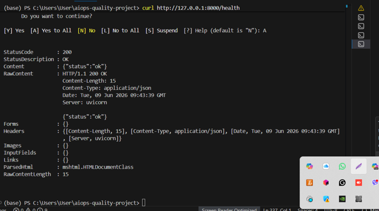
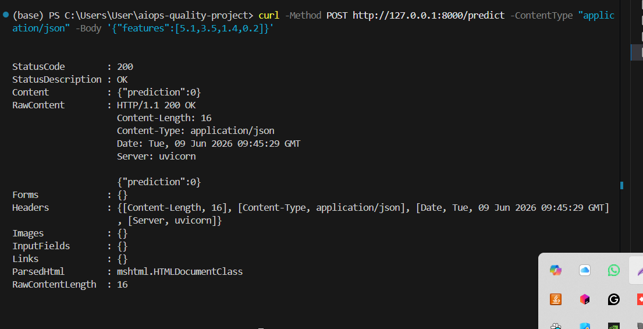
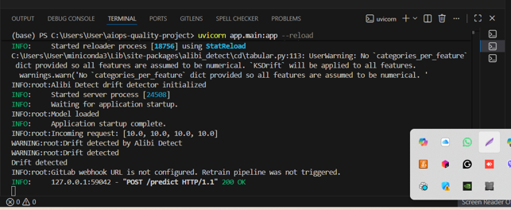
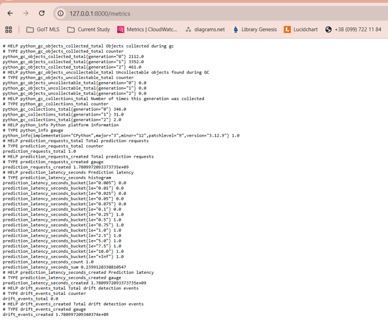
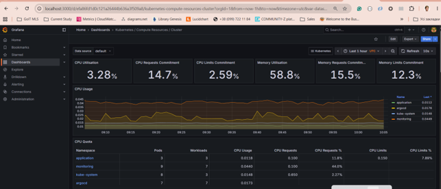
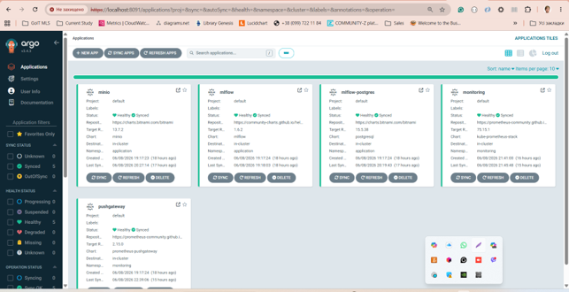

# AIOps Quality Project

## Overview

This project demonstrates an end-to-end AIOps and MLOps workflow deployed on Kubernetes using:

* FastAPI
* Machine Learning Model
* Alibi Detect
* Prometheus
* Grafana
* Loki
* Promtail
* GitLab CI
* Helm
* ArgoCD
* Kubernetes

The system performs online inference, monitors model behavior, detects potential data drift, exposes operational metrics, collects logs, and supports automated retraining workflows.

---

## Project Structure

```text
aiops-quality-project/
├── app/
│   ├── main.py
│   └── drift.py
├── model/
│   └── train.py
├── helm/
│   ├── Chart.yaml
│   ├── values.yaml
│   └── templates/
│       ├── deployment.yaml
│       └── service.yaml
├── argocd/
│   └── application.yaml
├── grafana/
│   └── dashboards.json
├── prometheus/
│   └── additionalScrapeConfigs.yaml
├── loki/
├── promtail/
├── screenshots/
├── Dockerfile
├── requirements.txt
├── .gitlab-ci.yml
└── README.md
```

The trained model artifact (`model.joblib`) is generated during training and is not stored in the repository.

---

# Architecture

## FastAPI Inference Service

The FastAPI application:

* Loads the model during startup
* Accepts prediction requests
* Logs incoming requests
* Performs drift detection using Alibi Detect
* Exposes Prometheus metrics
* Can trigger GitLab retraining pipeline via webhook

### Endpoints

| Endpoint   | Description        |
| ---------- | ------------------ |
| `/health`  | Health check       |
| `/predict` | Model inference    |
| `/metrics` | Prometheus metrics |

---

## Model Training

Training script:

```bash
python model/train.py
```

The script:

* Loads Iris dataset
* Trains RandomForestClassifier
* Saves model artifact

Output:

```text
model/model.joblib
```

---

# Running Locally

## Install Dependencies

```bash
pip install -r requirements.txt
```

## Train Model

```bash
python model/train.py
```

## Start FastAPI

```bash
uvicorn app.main:app --reload
```

---

# Testing Prediction

Example request:

```bash
curl -X POST http://localhost:8000/predict \
-H "Content-Type: application/json" \
-d '{"features":[5.1,3.5,1.4,0.2]}'
```

Example response:

```json
{
  "prediction": 0
}
```

---

# Drift Detection

The application uses **Alibi Detect** for data drift detection.

Incoming feature vectors are analyzed against a reference distribution generated from training data.

When drift is detected:

* A warning is written to application logs
* Drift metrics are incremented
* GitLab retraining webhook may be triggered

Example drift request:

```json
{
  "features": [10, 10, 10, 10]
}
```

Example log output:

```text
INFO:root:Incoming request: [10.0, 10.0, 10.0, 10.0]
WARNING:root:Drift detected by Alibi Detect
WARNING:root:Drift detected
Drift detected
```

---

# Logging

Application logs are written to stdout.

Example:

```text
INFO:root:Incoming request: [5.1, 3.5, 1.4, 0.2]
```

Drift example:

```text
WARNING:root:Drift detected by Alibi Detect
```

Logs are collected by:

* Promtail
* Loki

and can be visualized through Grafana.

---

# Prometheus Metrics

Metrics endpoint:

```text
/metrics
```

Available custom metrics:

```text
prediction_requests_total
prediction_latency_seconds
drift_events_total
```

---

# Grafana Dashboard

Dashboard visualizes:

* Prediction Requests
* Prediction Latency
* Drift Detection Events
* Kubernetes Resource Usage

Grafana provides real-time monitoring of service behavior and cluster resources.

---

# Helm Deployment

Deploy application:

```bash
helm install aiops-quality-project ./helm
```

Configuration is managed through:

```text
helm/values.yaml
```

Including:

* Image repository
* Image tag
* Service port
* Environment variables
* GitLab webhook URL

---

# ArgoCD

Application manifest:

```text
argocd/application.yaml
```

Features:

* Auto Sync
* Self Heal
* Namespace Auto Creation

ArgoCD continuously synchronizes Kubernetes resources with Git repository state.

---

# GitLab CI

Pipeline stages:

## Retrain Model

```bash
python model/train.py
```

Produces:

```text
model/model.joblib
```

## Build Image

```bash
docker build -t aiops-quality-project .
```

Pipeline can be triggered:

* Manually from GitLab
* Automatically through webhook invocation from drift detector

---

# Updating the Model

1. Modify training logic
2. Run retraining pipeline
3. Generate new model artifact
4. Build new Docker image
5. Commit changes
6. Push changes to repository
7. ArgoCD automatically redeploys application

---

# Verification Checklist

## API

* [x] Health endpoint works
* [x] Prediction endpoint works
* [x] Metrics endpoint works

## Drift Detection

* [x] Alibi Detect configured
* [x] Drift warning appears in logs
* [x] Drift metric is generated

## Monitoring

* [x] Metrics exposed to Prometheus
* [x] Dashboard configured in Grafana
* [x] Logs collected by Loki

## CI/CD

* [x] Retrain pipeline configured
* [x] Docker build configured
* [x] ArgoCD auto-sync enabled

## Kubernetes

* [x] Helm chart created
* [x] Service configured
* [x] Deployment configured

---

# Screenshots

## FastAPI Health Check



## Prediction Request



## Drift Detection Logs



## Metrics Endpoint



## Grafana Dashboard



## ArgoCD Application



---

# Technologies Used

* Python
* FastAPI
* Scikit-Learn
* Alibi Detect
* Prometheus
* Grafana
* Loki
* Promtail
* Docker
* Kubernetes
* Helm
* ArgoCD
* GitLab CI

---

# Author

Zoryana Yaremko

GoIT MLOps Final Project
